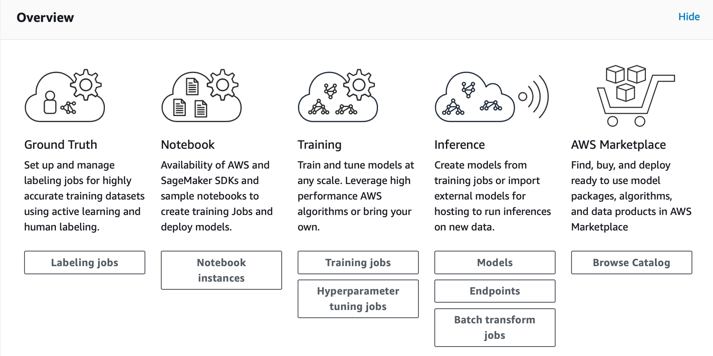
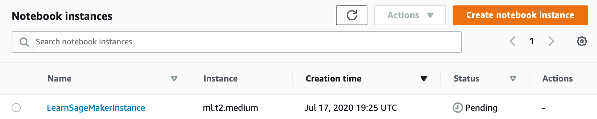

### Amazon SageMaker
__Amazon SageMaker__ is a fully managed service that is with the ability to __build__, __train__, and __deploy__ machine learning (__ML__) models quickly. 
> SageMaker removes the heavy lifting from each step of the machine learning process to make it easier to develop high quality models.

- [x] __Locate the Amazon SageMaker console.__

Use __AWS Management Console__ and find __Amazon SageMaker__.

- [x] __Create a SageMaker notebook.__

In __SageMaker Dashboard__, choose __Notebook instances__.  
  
 

In the following page, select __Create notebook instance__. Settings shall be similar to the screenshot. 
  

In the __IAM role__ field, choose __Create a new role__
>To have Amazon SageMaker create a role with the required permissions and assign it to your instance. Alternately, you can choose an existing IAM role in your account for this purpose.

In the following __Create an IAM role__ window, select __Any S3 bucket__. 
>This allows Amazon SageMaker instance to access all S3 buckets in the account. Later, a new S3 bucket will be created. However, if there is a bucket want to used instead, select Specific S3 buckets and specify the name of the bucket.

Will get back to __Create notebook instance__ after select __Create role__. Choose __Create notebook instance__ and proceed.

Go to the __Notebook instances__, will see the new ___LearnSageMakerInstance___ in Pending status. 

- [x] __Data Preparation.__
- [ ] more steps to go 
