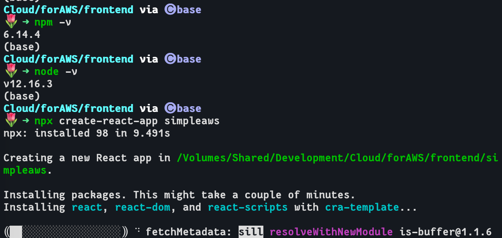
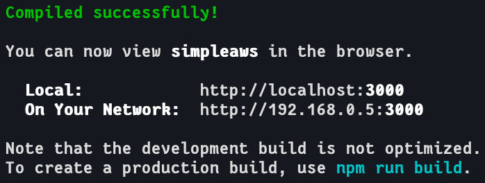
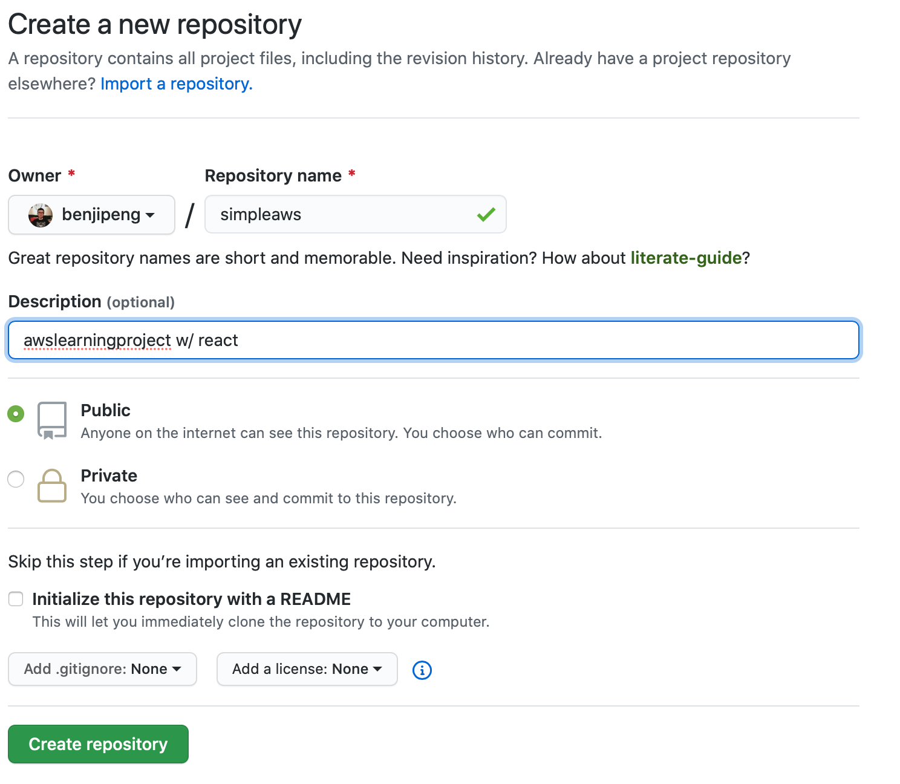
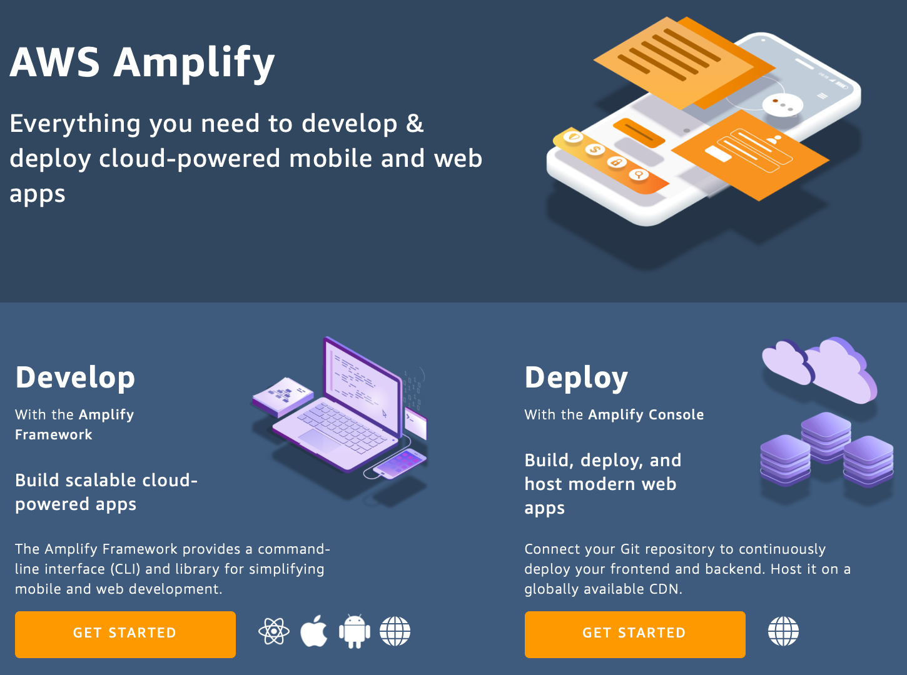
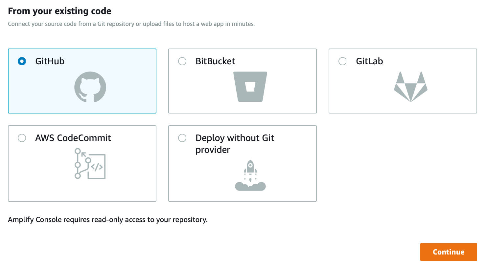
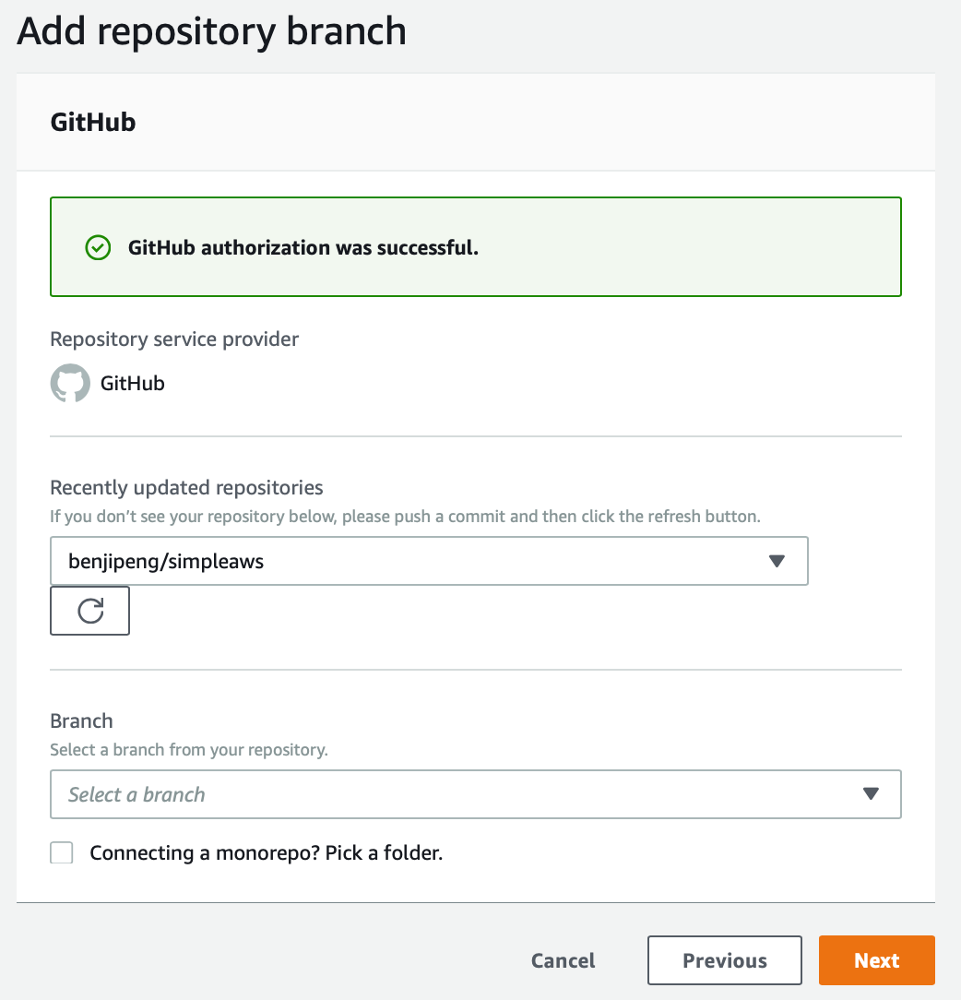

## Create React App
Check the version first and then run commands <br>

Cd into folder <br>

Launch website <br>

## Setup Git repository


Keep the repo link that is generated in the next screen.
Since create-react-app already initiated the git repo. In terminal, cd to the react project folder and run.
```
git remote add origin https://github.com/benjipeng/simpleaws.git
git push -u origin master
```
May be required to authenticate into github after _git push_.

## AWS Configs
Open the __AWS Management Console__ and locate __AWS Amplify__. Later, the GitHub repository just created will be linked to the AWS Amplify servie to build, deploy, and host the app on AWS. Get start by choosing __Deploy__.

Select __GitHub__.<br>

Walk through the authentication. In the __Add repository branch__ screen. Select the react project repo and the __master__ branch.<br>

In the follow-up screen, simply accept the default build settings (auto-detected from the app's _package.json_ build settings) and select __Next__. Review the final details and choose __Save and Deploy__